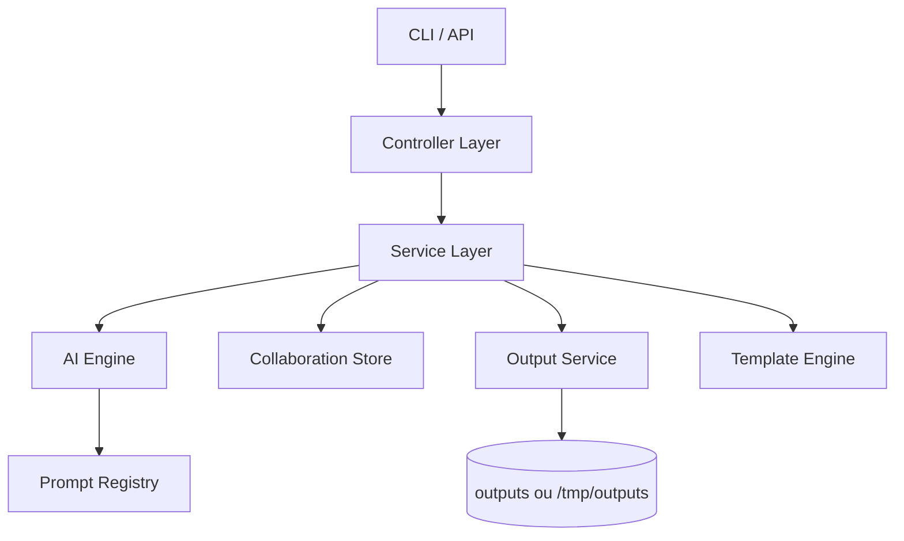
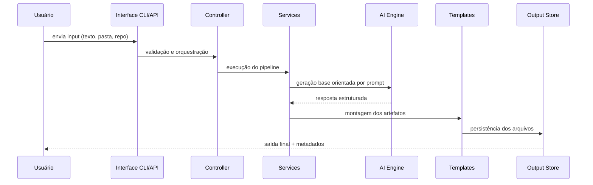
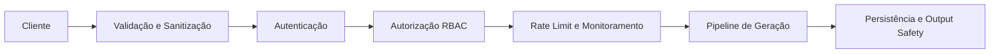

# RepoLaunch AI

<p align="center">
  <strong>Transforme aprendizado em projetos reais prontos para GitHub</strong>
</p>

<p align="center">
  Plataforma de geração de projetos com arquitetura em camadas, segurança por padrão e foco em execução real.
</p>

<p align="center">
  
  
  
  
  
  
</p>

---

## Créditos

**Projeto pensado, arquitetado e desenvolvido por Filipi Wanderley (FilipiWanderley).**

---

## Visão Geral

RepoLaunch AI recebe anotações, texto livre, pastas de código ou repositórios e transforma esse material em entregáveis profissionais para execução e publicação.

A proposta do produto é simples:

- reduzir o tempo entre aprendizado e entrega real;
- gerar documentação clara e consistente;
- estruturar arquitetura e plano de ação com padrão profissional;
- apoiar publicação, colaboração e evolução contínua.

---

## O Que o Projeto Entrega

### Entradas suportadas

- texto direto via CLI;
- arquivos Markdown e TXT;
- diretórios de projeto;
- análise de repositório existente.

### Saídas geradas

- README.md técnico e estratégico;
- ARCHITECTURE.md;
- ROADMAP.md;
- PROJECT_PLAN.md;
- PORTFOLIO_PITCH.md;
- exportação estruturada (Markdown, JSON, formato de issues).

---

## Status do Projeto

### Status macro

- MVP: concluído;
- V2 (análise de repositório, versionamento de prompts, export e sync GitHub): concluído;
- V3 (colaboração, compartilhamento público, trilha de auditoria, filtros): concluído;
- segurança de API e observabilidade operacional: concluído;
- deploy serverless (Vercel): concluído.

### Gráfico de progresso

```text
MVP                     [####################] 100%
V2                      [####################] 100%
V3                      [####################] 100%
Segurança e Auth        [####################] 100%
Observabilidade         [####################] 100%
Deploy Vercel           [####################] 100%
```

### Checklist funcional

- [x] CLI com fluxo completo (`init`, `analyze`, `generate`, `export`);
- [x] análise de repositório (`repo-analyze`);
- [x] sincronização com GitHub (`github-sync`);
- [x] gestão de prompts (`prompts list`);
- [x] API local para frontend e integrações;
- [x] histórico de gerações com export ZIP;
- [x] autenticação por token para rotas críticas;
- [x] rate limit por IP configurável;
- [x] colaboração por workspace com RBAC (owner/editor/viewer);
- [x] compartilhamento público por link;
- [x] trilha de auditoria por projeto;
- [x] login colaborativo opcional com sessão assinada;
- [x] pipeline de CI e workflow de release.

---

## Arquitetura

### Diagrama de camadas



### Fluxo ponta a ponta



### Estrutura de pastas

```text
repolaunch-ai/
|- src/
|  |- ai/
|  |- cli/
|  |- controllers/
|  |- server/
|  |- services/
|  |- templates/
|  |- utils/
|- config/
|- docs/
|- frontend/
|- outputs/
|- tests/
|- vercel.json
|- PRD.md
|- README.md
```

---

## Segurança

### Pilares aplicados

- credenciais via `.env`;
- proteção para não versionar `.env` no Git;
- autenticação de API via `x-api-token`;
- autenticação colaborativa opcional via sessão (`x-collab-token`);
- autorização por papéis (owner/editor/viewer);
- rate limiting por janela de tempo;
- validação de entrada e padronização de saída;
- trilha de auditoria de ações críticas;
- tratamento de erro sem exposição de dados sensíveis.

### Diagrama de defesa



### Variáveis de ambiente relevantes

- `API_AUTH_TOKEN`
- `API_RATE_LIMIT_WINDOW_MS`
- `API_RATE_LIMIT_MAX`
- `COLLAB_AUTH_USERS`
- `COLLAB_AUTH_SESSION_TTL_MINUTES`
- `AI_TIMEOUT_MS`
- `AI_MAX_RETRIES`
- `DEFAULT_PROMPT_VERSION`
- `GITHUB_TOKEN` (opcional)
- `GITHUB_REPO` (opcional)

---

## Stack Tecnológica

| Camada | Tecnologias | Objetivo |
|---|---|---|
| Runtime e Linguagem | Node.js 20+, TypeScript strict | desempenho, tipagem forte e manutenção segura |
| CLI | Commander | experiência consistente de linha de comando |
| API HTTP | Express 5, CORS | endpoints para frontend e integrações externas |
| Validação | Zod | contratos e validação de schemas |
| IA | compatível com Anthropic/OpenAI + fallback | geração resiliente e portável |
| Configuração | dotenv | gestão de ambiente local e deploy |
| Testes | Jest, ts-jest, Supertest | testes unitários e de contrato HTTP |
| Empacotamento | npm, workflow de release | distribuição e publicação da CLI |
| Deploy | Vercel (`src/server/vercel.ts`, `vercel.json`) | execução serverless |

---

## CLI

### Comandos principais

```bash
npx repolaunch init
npx repolaunch analyze ./meus-arquivos
npx repolaunch generate --mode technical --template portfolio-project
npx repolaunch generate --prompt-version v2 --mode recruiter --template saas
npx repolaunch export --format json
npx repolaunch repo-analyze .
npx repolaunch github-sync --repo FilipiWanderley/RepoLaunch-AI
npx repolaunch prompts list
```

### Modos de saída

- `technical`
- `recruiter`
- `simplified`

### Templates disponíveis

- `portfolio-project`
- `saas`
- `cli-tool`
- `ai-workflow`

### Formatos de exportação

- `markdown`
- `json`
- `issues`

---

## API

### Inicialização local

```bash
npm run dev:api
```

### Endpoints principais

- `GET /api/health`
- `GET /api/health/details`
- `GET /api/prompts`
- `POST /api/generate`
- `GET /api/history?limit=10`
- `GET /api/history/:generationId/export.zip`
- `GET /api/metrics?windowMinutes=15`
- `GET/POST /api/collab/projects`
- `GET /api/collab/projects/:projectId/members`
- `POST /api/collab/projects/:projectId/members`
- `PATCH /api/collab/projects/:projectId/members/:userId`
- `GET /api/collab/projects/:projectId/audit?limit=30`
- `POST /api/collab/projects/:projectId/generations`
- `POST /api/collab/projects/:projectId/share`
- `POST /api/collab/auth/login` (opcional)
- `GET /api/share/:shareId`

### Observabilidade

- contagem de requisições por janela;
- taxa de erro e distribuição por status (`2xx`, `3xx`, `4xx`, `5xx`);
- série temporal recente de tráfego e bloqueios de rate limit;
- health detalhado com uptime, memória e checks de dependências.

---

## Frontend e Colaboração

A interface web consome a API local e oferece:

- gestão de workspaces colaborativos;
- navegação por gerações vinculadas ao projeto;
- filtros por metadados (`mode`, `template`, `promptVersion`, `provider`);
- chips de filtro combináveis (lógica AND);
- persistência de estado no URL (`q`, `chips`, `gen`);
- modo de leitura pública por link compartilhado.

---

## Deploy e Release

### Release da CLI

- workflow: `.github/workflows/release.yml`;
- gatilhos por tag `v*` e `workflow_dispatch`;
- publicação condicionada ao secret `NPM_TOKEN`.

### Comandos de validação pré-release

```bash
npm run release:check
npm run release:pack
```

### Deploy serverless

- entrypoint dedicado para Vercel em `src/server/vercel.ts`;
- configuração de build/rotas em `vercel.json`;
- persistência ajustada para `/tmp/outputs` em ambiente Vercel.

---

## Qualidade de Engenharia

- arquitetura modular por responsabilidades;
- separação clara entre interface, orquestração e domínio;
- cobertura de testes automatizados;
- padrão de resiliência com timeout, retry e fallback;
- pipeline de CI para regressão e build;
- documentação orientada a produto e operação.

---

## Quick Start

```bash
git clone https://github.com/FilipiWanderley/RepoLaunch-AI.git
cd RepoLaunch-AI
cp .env.example .env
npm install
npm run ci
```

---

## Contribuição

Contribuições são bem-vindas com PRs pequenas, objetivas e testadas.

Checklist recomendado antes de abrir PR:

- `npm run typecheck`
- `npm test`
- `npm run build`

---

## Licença

ISC

---

## Autor

<p>
  <a href="https://github.com/FilipiWanderley">
    
  </a>
</p>

**[Filipi Wanderley](https://github.com/FilipiWanderley)**

- idealizador do produto;
- responsável pela arquitetura;
- responsável pela implementação de ponta a ponta.

RepoLaunch AI foi concebido para transformar conhecimento em ativo de carreira com engenharia de alto nível.
