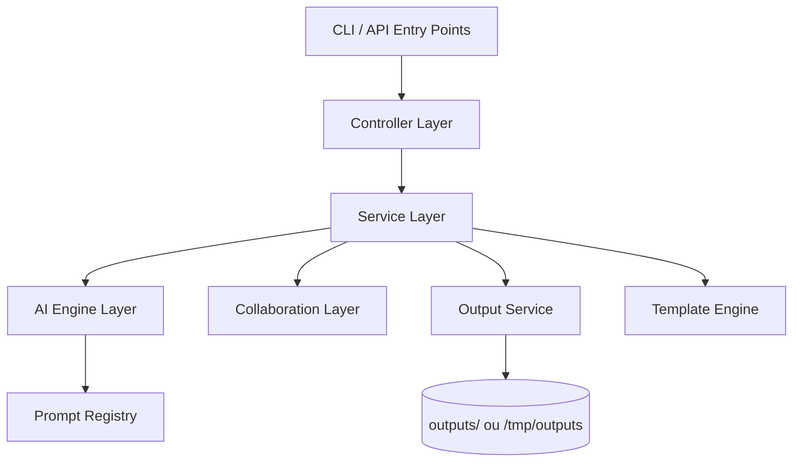
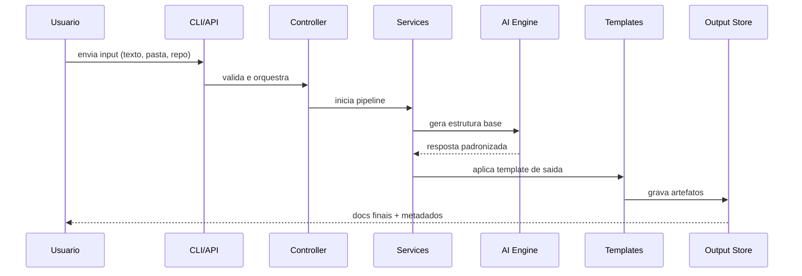
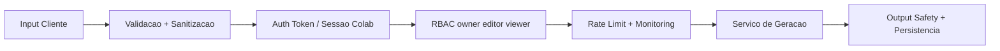

# RepoLaunch AI

<p align="center">
  <strong>Transforme aprendizado em projetos reais prontos para GitHub</strong>
</p>

<p align="center">
  Plataforma de geracao de projeto com arquitetura em camadas, seguranca por padrao e foco em entrega real.
</p>

<p align="center">
  
  
  
  
  
  
</p>

---

## Creditos

**Projeto pensado, arquitetado e desenvolvido por Filipi Wanderley (FilipiWanderley).**

---

## Resumo Executivo

RepoLaunch AI recebe notas, ideias, texto livre ou repositorios e transforma isso em documentacao profissional e plano de execucao pronto para publicar.

Principais entregaveis gerados:

- README.md
- ARCHITECTURE.md
- ROADMAP.md
- PROJECT_PLAN.md
- PORTFOLIO_PITCH.md
- sugestoes de issues

---

## Status do Projeto

### Macro status

- MVP: concluido
- V2 (analise de repo, prompt versioning, export e GitHub sync): concluido
- V3 Core (colaboracao, compartilhamento, auditoria e filtros): concluido
- Endpoints operacionais (health, metrics, history, zip): concluido
- Deploy serverless (Vercel): concluido

### Grafico de progresso por etapa

```text
MVP                     [####################] 100%
V2                      [####################] 100%
V3 Core                 [####################] 100%
Observabilidade         [####################] 100%
Seguranca API           [####################] 100%
Deploy Vercel           [####################] 100%
```

### Checklist de capacidade entregue

- [x] CLI funcional (`init`, `analyze`, `generate`, `export`, `repo-analyze`, `github-sync`, `prompts list`)
- [x] API local para frontend e integracao externa
- [x] Controle de autenticacao por token para rotas criticas
- [x] Rate limit configuravel por ambiente
- [x] Historico e export ZIP por geracao
- [x] Colaboracao com papeis owner/editor/viewer
- [x] Link publico de compartilhamento
- [x] Trilha de auditoria por workspace
- [x] Pipeline CI e fluxo de release

---

## Arquitetura (Padrao Profissional)

### Visao de camadas



### Fluxo ponta a ponta



### Estrutura de pastas

```text
repolaunch-ai/
|- src/
|  |- ai/
|  |- cli/
|  |- controllers/
|  |- server/
|  |- services/
|  |- templates/
|  |- utils/
|- config/
|- docs/
|- frontend/
|- outputs/
|- tests/
|- vercel.json
|- PRD.md
|- README.md
```

---

## Seguranca em Camadas

### Principios aplicados

- segredos em `.env` (nunca versionar `.env`)
- autenticacao por `x-api-token` para rotas sensiveis
- rate limiting por IP com janela configuravel
- validacao de entrada e padronizacao de output
- controles de permissao em colaboracao (RBAC)
- trilha de auditoria para acoes criticas

### Diagrama de defesa



### Variaveis de seguranca e operacao

- `API_AUTH_TOKEN`
- `API_RATE_LIMIT_WINDOW_MS`
- `API_RATE_LIMIT_MAX`
- `COLLAB_AUTH_USERS`
- `COLLAB_AUTH_SESSION_TTL_MINUTES`
- `AI_TIMEOUT_MS`
- `AI_MAX_RETRIES`

---

## Stack Utilizada

| Camada | Tecnologias | Objetivo |
|---|---|---|
| Runtime e linguagem | Node.js 20+, TypeScript strict | Base performatica com tipagem forte |
| CLI | Commander | Comandos consistentes para fluxo de produtividade |
| API HTTP | Express 5, CORS | Exposicao de endpoints para frontend e integracao |
| Validacao | Zod | Contratos e schema safety |
| IA | Anthropic/OpenAI compativel + fallback | Geracao resiliente e portavel |
| Configuracao | dotenv | Gestao de ambiente local e deploy |
| Testes | Jest, ts-jest, Supertest | Cobertura de unidade e contrato HTTP |
| Empacotamento | npm, release workflow | Publicacao e distribuicao da CLI |
| Deploy serverless | Vercel (`src/server/vercel.ts`, `vercel.json`) | Execucao pronta para ambiente serverless |

---

## API e Operacao

### Endpoints principais

- `GET /api/health`
- `GET /api/health/details`
- `GET /api/prompts`
- `POST /api/generate`
- `GET /api/history?limit=10`
- `GET /api/history/:generationId/export.zip`
- `GET /api/metrics?windowMinutes=15`
- `GET/POST /api/collab/projects`
- `POST /api/collab/auth/login` (opcional)
- `GET /api/share/:shareId`

### Observabilidade

- metricas por janela de tempo
- taxa de erro e status codes
- visao de uptime e checks de dependencia
- monitoramento de degradacao via health detalhado

---

## Quick Start

```bash
git clone https://github.com/FilipiWanderley/RepoLaunch-AI.git
cd RepoLaunch-AI
cp .env.example .env
npm install
npm run ci
```

### CLI

```bash
npx repolaunch init
npx repolaunch analyze ./meus-arquivos
npx repolaunch generate --mode technical --template portfolio-project
npx repolaunch export --format json
```

### API local

```bash
npm run dev:api
```

---

## Qualidade de Engenharia

- arquitetura modular por responsabilidade
- testes automatizados e pipeline CI
- padrao de falha controlada (fallback e retry)
- separacao clara entre camada de entrada, servico e persistencia
- base preparada para evolucao sem acoplamento desnecessario

---

## Contribuicao

Contribuicoes sao bem-vindas com PRs pequenas, objetivas e testadas.

Checklist recomendado antes de abrir PR:

- `npm run typecheck`
- `npm test`
- `npm run build`

---

## Licenca

ISC

---

## Autor

**Filipi Wanderley (FilipiWanderley)**

- idealizador do produto
- responsavel pela arquitetura
- responsavel pela implementacao de ponta a ponta

RepoLaunch AI foi concebido para transformar conhecimento em ativo de carreira com engenharia de alto nivel.