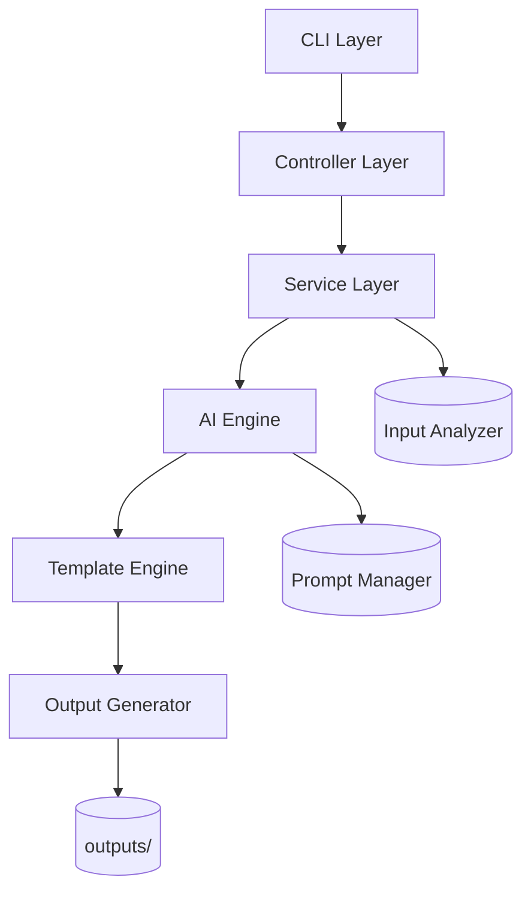
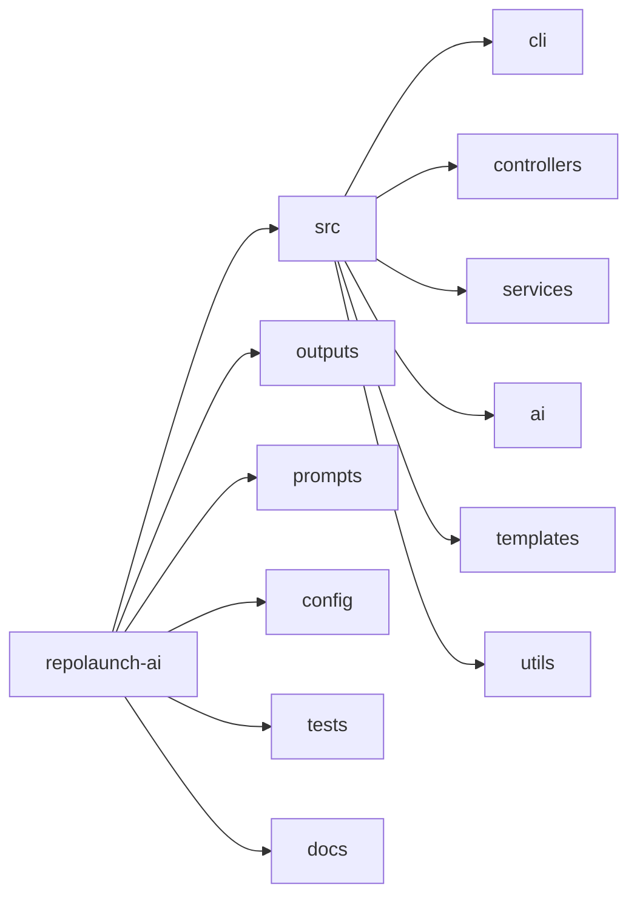

# RepoLaunch AI

<p align="center">
  <strong>Transforme aprendizado em projetos reais prontos para GitHub</strong>
</p>

<p align="center">
  Construído por <strong>FilipiWanderley</strong> para transformar estudo em execução de verdade.
</p>

<p align="center">
  
  
  
  
  
  
</p>

---

## O problema que quase todo dev enfrenta

Você estuda, aprende e pratica, mas trava em pontos críticos:

- Não sei qual projeto criar
- Não sei estruturar arquitetura com clareza
- Não sei escrever documentação que impressiona
- Não consigo transformar aprendizado em ativo de carreira

RepoLaunch AI foi criado para fechar esse gap.

---

## O que entra e o que sai

### Input

- Anotações em Markdown ou TXT
- Pasta de código
- Ideias soltas em texto
- Conteúdo de cursos (exemplo: Anthropic Academy)

### Output

- README.md profissional
- ARCHITECTURE.md
- ROADMAP.md
- PROJECT_PLAN.md
- PORTFOLIO_PITCH.md
- Sugestões de issues

---

## Impacto em segundos

### Exemplo rápido

Input:

> Fiz um curso de IA e quero criar algo com isso

Output:

- projeto estruturado
- arquitetura definida
- plano de execução
- pitch pronto para LinkedIn

---

## Quick Start

```bash
git clone https://github.com/FilipiWanderley/repolaunch-ai
cd repolaunch-ai
cp .env.example .env
# adicione sua API key

npm install
npm run ci
npx repolaunch init
npx repolaunch analyze ./meus-arquivos
npx repolaunch generate --mode technical --template portfolio-project
npx repolaunch generate --prompt-version v2 --mode technical --template portfolio-project
npx repolaunch prompts list
npm run dev:api
npx repolaunch repo-analyze .
npx repolaunch github-sync --repo FilipiWanderley/RepoLaunch-AI
npx repolaunch export --format json
```

### Modos de saida

- technical
- recruiter
- simplified

### Templates de projeto

- portfolio-project
- saas
- cli-tool
- ai-workflow

### Formatos de export

- json
- markdown
- issues (GitHub issues)

### API local para frontend

- iniciar API: `npm run dev:api`
- healthcheck: `GET http://localhost:8787/api/health`
- health detalhado: `GET http://localhost:8787/api/health/details`
- prompts: `GET http://localhost:8787/api/prompts`
- gerar docs: `POST http://localhost:8787/api/generate`
- historico de geracoes: `GET http://localhost:8787/api/history?limit=10`
- export zip por geracao: `GET http://localhost:8787/api/history/:generationId/export.zip`
- metricas de API: `GET http://localhost:8787/api/metrics?windowMinutes=15`
- colaboracao: `GET/POST http://localhost:8787/api/collab/projects`
- vincular geracao ao projeto: `POST http://localhost:8787/api/collab/projects/:projectId/generations`
- gerar link publico: `POST http://localhost:8787/api/collab/projects/:projectId/share`
- leitura publica compartilhada: `GET http://localhost:8787/api/share/:shareId`

O endpoint de metricas inclui:

- total de requests e erros
- breakdown por status code (`2xx`, `3xx`, `4xx`, `5xx`)
- serie temporal da janela recente (requests, erros e rate-limit por minuto)

O health detalhado inclui:

- status geral (`ok` ou `degraded`)
- uptime e memoria do processo
- checks de env, prompt registry, provider de IA e escrita em `outputs`/`config`

### Seguranca da API local

- `API_AUTH_TOKEN`: quando definido, exige header `x-api-token` em `/api/prompts` e `/api/generate`
- `API_RATE_LIMIT_WINDOW_MS`: janela do rate limit em ms
- `API_RATE_LIMIT_MAX`: maximo de requisicoes por IP por janela

### Exemplos de saida por modo

- [technical](docs/examples/technical.md)
- [recruiter](docs/examples/recruiter.md)
- [simplified](docs/examples/simplified.md)
- guia de uso: [docs/USAGE.md](docs/USAGE.md)

---

## Configuracao de resiliencia

No arquivo `.env`, voce pode ajustar:

- `AI_TIMEOUT_MS`: timeout por chamada ao provider
- `AI_MAX_RETRIES`: tentativas de retry por provider
- `DEFAULT_PROMPT_VERSION`: versao de prompt usada por padrao no generate
- `LOG_LEVEL`: debug, info, warning ou error
- `GITHUB_TOKEN`: token para publicar issues (opcional)
- `GITHUB_REPO`: repositorio padrao no formato owner/repo

### Registry de prompt

- arquivo: `config/prompt-registry.json`
- comando: `repolaunch prompts list`
- se o arquivo estiver ausente ou invalido, o sistema usa prompts embutidos como fallback

---

## Erros comuns (CLI)

- `ANALYSIS_NOT_FOUND`: rode `repolaunch analyze --text "..."` antes de `generate` sem input.
- `TARGET_NOT_FOUND`: revise o caminho informado em `analyze`.
- `INVALID_ANALYZE_INPUT`: informe `--text` ou um caminho valido.

---

## Arquitetura profissional



---

## Estrutura de pastas com visão de camadas



---

## Segurança em camadas


---

## Stack Cards

| Camada | Stack | Objetivo |
|---|---|---|
| Runtime e CLI |    | Performance, tipagem forte e UX de terminal profissional |
| IA e prompts |   | Geração confiável com fallback e padronização de saída |
| Qualidade e segurança |    | Resiliência, validação de contrato e segurança de configuração |

---

## Como funciona

1. Usuário fornece input (texto, arquivos ou repositório)
2. Input Analyzer extrai intenção, contexto e tema
3. AI Engine produz estrutura base com prompts controlados
4. Template Engine organiza os documentos finais
5. Output Generator cria os arquivos automaticamente

---

## Casos de uso reais

### Devs

- Transformar estudo em projeto concreto
- Gerar documentação profissional para portfólio

### Estudantes

- Montar portfólio com mais velocidade
- Estruturar aprendizado em entregáveis

### Criadores

- Organizar ideias e publicar com narrativa técnica

---

## Engenharia que recrutador enxerga

- Arquitetura modular por camadas
- Separação clara de responsabilidades
- Engine de templates reutilizável
- Abstração para múltiplos provedores de IA
- CLI profissional com foco em ship rápido
- Design orientado a produto
- Segurança como requisito de base

---

## Roadmap

### v1 - MVP

- Geração de README
- ROADMAP e PROJECT_PLAN
- Fluxo base de análise de texto

### v2

- Análise de repositório existente
- Integração com GitHub para issues e PRs

### v3

- Interface web
- Colaboração
- Exportação avançada

---

## Filosofia

> Aprender é ótimo.
> Construir é o que muda sua carreira.

---

## Inspiração

Projeto desenvolvido por FilipiWanderley, inspirado por aprendizado em IA aplicada,
incluindo conteúdos da Anthropic Academy.

---

## Contribuição

Contribuições são bem-vindas.

Se esse projeto te ajudou, deixe uma estrela e compartilhe com quem está evoluindo na carreira.

---

## Autor

**FilipiWanderley**

- Engenheiro focado em IA aplicada
- Construindo ferramentas úteis para desenvolvedores
- Transformando aprendizado em execução real

---

## RepoLaunch AI

**By FilipiWanderley**

Transforme aprendizado em projetos.
Transforme projetos em oportunidades.