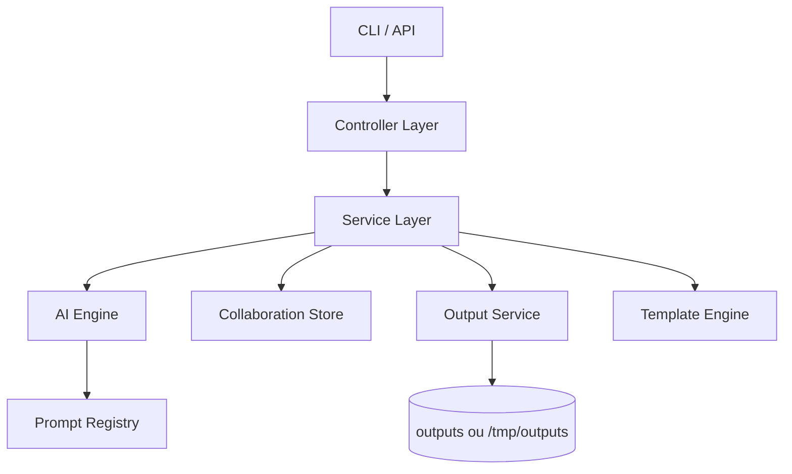
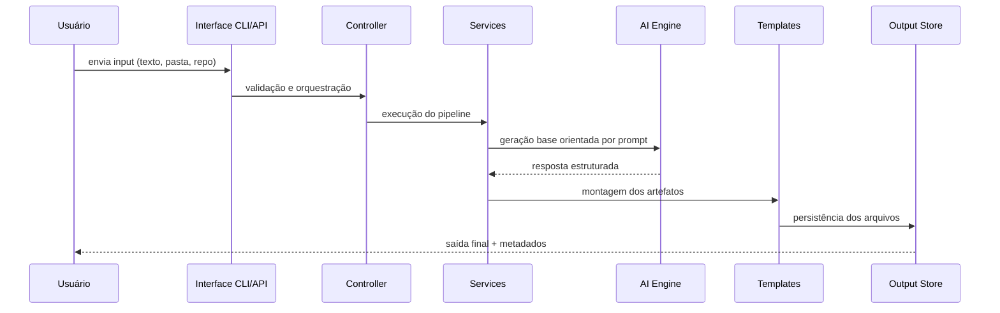
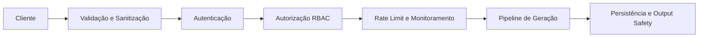
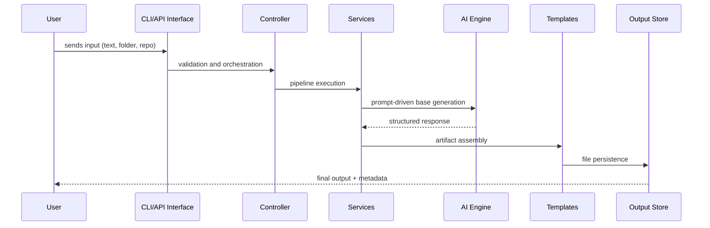
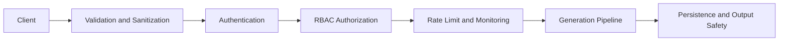

# RepoLaunch AI

<p align="center">
  <strong>Transforme aprendizado em projetos reais prontos para GitHub</strong>
</p>

<p align="center">
  Plataforma de geração de projetos com arquitetura em camadas, segurança por padrão e foco em execução real.
</p>

<p align="center">
  
  
  
  
  
  
</p>

---

## Créditos

**Projeto pensado, arquitetado e desenvolvido por Filipi Wanderley (FilipiWanderley).**

---

## Visão Geral

RepoLaunch AI recebe anotações, texto livre, pastas de código ou repositórios e transforma esse material em entregáveis profissionais para execução e publicação.

A proposta do produto é simples:

- reduzir o tempo entre aprendizado e entrega real;
- gerar documentação clara e consistente;
- estruturar arquitetura e plano de ação com padrão profissional;
- apoiar publicação, colaboração e evolução contínua.

---

## O Que o Projeto Entrega

### Entradas suportadas

- texto direto via CLI;
- arquivos Markdown e TXT;
- diretórios de projeto;
- análise de repositório existente.

### Saídas geradas

- README.md técnico e estratégico;
- ARCHITECTURE.md;
- ROADMAP.md;
- PROJECT_PLAN.md;
- PORTFOLIO_PITCH.md;
- exportação estruturada (Markdown, JSON, formato de issues).

---

## Status do Projeto

### Status macro

- MVP: concluído;
- V2 (análise de repositório, versionamento de prompts, export e sync GitHub): concluído;
- V3 (colaboração, compartilhamento público, trilha de auditoria, filtros): concluído;
- segurança de API e observabilidade operacional: concluído;
- deploy serverless (Vercel): concluído.

### Gráfico de progresso

```text
MVP                     [####################] 100%
V2                      [####################] 100%
V3                      [####################] 100%
Segurança e Auth        [####################] 100%
Observabilidade         [####################] 100%
Deploy Vercel           [####################] 100%
```

### Checklist funcional

- [x] CLI com fluxo completo (`init`, `analyze`, `generate`, `export`);
- [x] análise de repositório (`repo-analyze`);
- [x] sincronização com GitHub (`github-sync`);
- [x] gestão de prompts (`prompts list`);
- [x] API local para frontend e integrações;
- [x] histórico de gerações com export ZIP;
- [x] autenticação por token para rotas críticas;
- [x] rate limit por IP configurável;
- [x] colaboração por workspace com RBAC (owner/editor/viewer);
- [x] compartilhamento público por link;
- [x] trilha de auditoria por projeto;
- [x] login colaborativo opcional com sessão assinada;
- [x] pipeline de CI e workflow de release.

---

## Arquitetura

### Diagrama de camadas



### Fluxo ponta a ponta



### Estrutura de pastas

```text
repolaunch-ai/
|- src/
|  |- ai/
|  |- cli/
|  |- controllers/
|  |- server/
|  |- services/
|  |- templates/
|  |- utils/
|- config/
|- docs/
|- frontend/
|- outputs/
|- tests/
|- vercel.json
|- PRD.md
|- README.md
```

---

## Segurança

### Pilares aplicados

- credenciais via `.env`;
- proteção para não versionar `.env` no Git;
- autenticação de API via `x-api-token`;
- autenticação colaborativa opcional via sessão (`x-collab-token`);
- autorização por papéis (owner/editor/viewer);
- rate limiting por janela de tempo;
- validação de entrada e padronização de saída;
- trilha de auditoria de ações críticas;
- tratamento de erro sem exposição de dados sensíveis.

### Diagrama de defesa



### Variáveis de ambiente relevantes

- `API_AUTH_TOKEN`
- `API_RATE_LIMIT_WINDOW_MS`
- `API_RATE_LIMIT_MAX`
- `COLLAB_AUTH_USERS`
- `COLLAB_AUTH_SESSION_TTL_MINUTES`
- `AI_TIMEOUT_MS`
- `AI_MAX_RETRIES`
- `DEFAULT_PROMPT_VERSION`
- `GITHUB_TOKEN` (opcional)
- `GITHUB_REPO` (opcional)

---

## Stack Tecnológica

| Camada | Tecnologias | Objetivo |
|---|---|---|
| Runtime e Linguagem | Node.js 20+, TypeScript strict | desempenho, tipagem forte e manutenção segura |
| CLI | Commander | experiência consistente de linha de comando |
| API HTTP | Express 5, CORS | endpoints para frontend e integrações externas |
| Validação | Zod | contratos e validação de schemas |
| IA | compatível com Anthropic/OpenAI + fallback | geração resiliente e portável |
| Configuração | dotenv | gestão de ambiente local e deploy |
| Testes | Jest, ts-jest, Supertest | testes unitários e de contrato HTTP |
| Empacotamento | npm, workflow de release | distribuição e publicação da CLI |
| Deploy | Vercel (`src/server/vercel.ts`, `vercel.json`) | execução serverless |

---

## CLI

### Comandos principais

```bash
npx repolaunch init
npx repolaunch analyze ./meus-arquivos
npx repolaunch generate --mode technical --template portfolio-project
npx repolaunch generate --prompt-version v2 --mode recruiter --template saas
npx repolaunch export --format json
npx repolaunch repo-analyze .
npx repolaunch github-sync --repo FilipiWanderley/RepoLaunch-AI
npx repolaunch prompts list
```

### Modos de saída

- `technical`
- `recruiter`
- `simplified`

### Templates disponíveis

- `portfolio-project`
- `saas`
- `cli-tool`
- `ai-workflow`

### Formatos de exportação

- `markdown`
- `json`
- `issues`

---

## API

### Inicialização local

```bash
npm run dev:api
```

### Endpoints principais

- `GET /api/health`
- `GET /api/health/details`
- `GET /api/prompts`
- `POST /api/generate`
- `GET /api/history?limit=10`
- `GET /api/history/:generationId/export.zip`
- `GET /api/metrics?windowMinutes=15`
- `GET/POST /api/collab/projects`
- `GET /api/collab/projects/:projectId/members`
- `POST /api/collab/projects/:projectId/members`
- `PATCH /api/collab/projects/:projectId/members/:userId`
- `GET /api/collab/projects/:projectId/audit?limit=30`
- `POST /api/collab/projects/:projectId/generations`
- `POST /api/collab/projects/:projectId/share`
- `POST /api/collab/auth/login` (opcional)
- `GET /api/share/:shareId`

### Observabilidade

- contagem de requisições por janela;
- taxa de erro e distribuição por status (`2xx`, `3xx`, `4xx`, `5xx`);
- série temporal recente de tráfego e bloqueios de rate limit;
- health detalhado com uptime, memória e checks de dependências.

---

## Frontend e Colaboração

A interface web consome a API local e oferece:

- gestão de workspaces colaborativos;
- navegação por gerações vinculadas ao projeto;
- filtros por metadados (`mode`, `template`, `promptVersion`, `provider`);
- chips de filtro combináveis (lógica AND);
- persistência de estado no URL (`q`, `chips`, `gen`);
- modo de leitura pública por link compartilhado.

---

## Deploy e Release

### Release da CLI

- workflow: `.github/workflows/release.yml`;
- gatilhos por tag `v*` e `workflow_dispatch`;
- publicação condicionada ao secret `NPM_TOKEN`.

### Comandos de validação pré-release

```bash
npm run release:check
npm run release:pack
```

### Deploy serverless

- entrypoint dedicado para Vercel em `src/server/vercel.ts`;
- configuração de build/rotas em `vercel.json`;
- persistência ajustada para `/tmp/outputs` em ambiente Vercel.

---

## Qualidade de Engenharia

- arquitetura modular por responsabilidades;
- separação clara entre interface, orquestração e domínio;
- cobertura de testes automatizados;
- padrão de resiliência com timeout, retry e fallback;
- pipeline de CI para regressão e build;
- documentação orientada a produto e operação.

---

## Quick Start

```bash
git clone https://github.com/FilipiWanderley/RepoLaunch-AI.git
cd RepoLaunch-AI
cp .env.example .env
npm install
npm run ci
```

---

## Como Rodar Localmente

### Pré-requisitos

- Node.js 20 ou superior
- npm 9 ou superior
- Chave de API da Anthropic ou OpenAI (ao menos uma)

### 1. Clone o repositório

```bash
git clone https://github.com/FilipiWanderley/RepoLaunch-AI.git
cd RepoLaunch-AI
```

### 2. Instale as dependências

```bash
npm install
```

### 3. Configure o ambiente

Copie o arquivo de exemplo e preencha as variáveis necessárias:

```bash
cp .env.example .env
```

Edite o `.env` e defina ao menos:

```env
ANTHROPIC_API_KEY=sua_chave_aqui   # para usar Claude
OPENAI_API_KEY=sua_chave_aqui      # para usar GPT (opcional)
API_AUTH_TOKEN=um_token_secreto    # protege as rotas da API
```

As demais variáveis já possuem valores padrão no `.env.example` e funcionam sem alteração para uso local.

### 4. Compile o projeto

```bash
npm run build
```

### 5. Rode a CLI

Em modo de desenvolvimento (sem compilar a cada mudança):

```bash
npm run dev -- init
npm run dev -- analyze ./minha-pasta
npm run dev -- generate --mode technical --template portfolio-project
```

Com o build gerado:

```bash
npm start -- init
```

### 6. Rode a API

Em modo de desenvolvimento:

```bash
npm run dev:api
```

Com o build gerado:

```bash
npm run start:api
```

A API ficará disponível em `http://localhost:3000`. Para verificar:

```bash
curl http://localhost:3000/api/health
```

### 7. Rode o frontend

O frontend é uma aplicação estática. Basta abrir o arquivo `frontend/index.html` diretamente no navegador ou servir com qualquer servidor HTTP simples:

```bash
npx serve frontend
```

Ele consome a API local em `http://localhost:3000` por padrão.

### 8. Execute os testes

```bash
npm test
```

Para rodar typecheck, testes e build de uma vez (mesmo que o CI):

```bash
npm run ci
```

---

## Contribuição

Contribuições são bem-vindas com PRs pequenas, objetivas e testadas.

Checklist recomendado antes de abrir PR:

- `npm run typecheck`
- `npm test`
- `npm run build`

---

## Licença

ISC

---

## Autor

<p>
  <a href="https://github.com/FilipiWanderley">
    
  </a>
</p>

**[Filipi Wanderley](https://github.com/FilipiWanderley)**

- idealizador do produto;
- responsável pela arquitetura;
- responsável pela implementação de ponta a ponta.

RepoLaunch AI foi concebido para transformar conhecimento em ativo de carreira com engenharia de alto nível.

---

# RepoLaunch AI (English Version)

<p align="center">
  <strong>Turn learning into real projects ready for GitHub</strong>
</p>

<p align="center">
  A project generation platform with layered architecture, secure-by-default design, and focus on real execution.
</p>

<p align="center">
  
  
  
  
  
  
</p>

---

## Credits

**Project conceived, architected, and developed by Filipi Wanderley (FilipiWanderley).**

---

## Overview

RepoLaunch AI receives notes, free text, code folders, or repositories and transforms that material into professional deliverables ready for execution and publishing.

The product proposition is simple:

- reduce the time between learning and real delivery;
- generate clear and consistent documentation;
- structure architecture and action plans with professional standards;
- support publishing, collaboration, and continuous evolution.

---

## What the Project Delivers

### Supported inputs

- direct text via CLI;
- Markdown and TXT files;
- project directories;
- analysis of an existing repository.

### Generated outputs

- technical and strategic README.md;
- ARCHITECTURE.md;
- ROADMAP.md;
- PROJECT_PLAN.md;
- PORTFOLIO_PITCH.md;
- structured export (Markdown, JSON, issue format).

---

## Project Status

### Macro status

- MVP: completed;
- V2 (repository analysis, prompt versioning, export and GitHub sync): completed;
- V3 (collaboration, public sharing, audit trail, filters): completed;
- API security and operational observability: completed;
- serverless deployment (Vercel): completed.

### Progress chart

```text
MVP                     [####################] 100%
V2                      [####################] 100%
V3                      [####################] 100%
Security and Auth       [####################] 100%
Observability           [####################] 100%
Vercel Deploy           [####################] 100%
```

### Functional checklist

- [x] CLI with full flow (`init`, `analyze`, `generate`, `export`);
- [x] repository analysis (`repo-analyze`);
- [x] GitHub synchronization (`github-sync`);
- [x] prompt management (`prompts list`);
- [x] local API for frontend and integrations;
- [x] generation history with ZIP export;
- [x] token authentication for critical routes;
- [x] configurable IP-based rate limiting;
- [x] workspace collaboration with RBAC (owner/editor/viewer);
- [x] public sharing by link;
- [x] project audit trail;
- [x] optional collaborative login with signed session;
- [x] CI pipeline and release workflow.

---

## Architecture

### Layer diagram


### End-to-end flow



### Folder structure

```text
repolaunch-ai/
|- src/
|  |- ai/
|  |- cli/
|  |- controllers/
|  |- server/
|  |- services/
|  |- templates/
|  |- utils/
|- config/
|- docs/
|- frontend/
|- outputs/
|- tests/
|- vercel.json
|- PRD.md
|- README.md
```

---

## Security

### Applied pillars

- credentials via `.env`;
- protection to avoid versioning `.env` in Git;
- API authentication via `x-api-token`;
- optional collaborative authentication via session (`x-collab-token`);
- role-based authorization (owner/editor/viewer);
- time-window rate limiting;
- input validation and output standardization;
- audit trail for critical actions;
- error handling without exposing sensitive data.

### Defense diagram



### Relevant environment variables

- `API_AUTH_TOKEN`
- `API_RATE_LIMIT_WINDOW_MS`
- `API_RATE_LIMIT_MAX`
- `COLLAB_AUTH_USERS`
- `COLLAB_AUTH_SESSION_TTL_MINUTES`
- `AI_TIMEOUT_MS`
- `AI_MAX_RETRIES`
- `DEFAULT_PROMPT_VERSION`
- `GITHUB_TOKEN` (optional)
- `GITHUB_REPO` (optional)

---

## Tech Stack

| Layer | Technologies | Goal |
|---|---|---|
| Runtime and Language | Node.js 20+, TypeScript strict | performance, strong typing, and safe maintenance |
| CLI | Commander | consistent command-line experience |
| HTTP API | Express 5, CORS | endpoints for frontend and external integrations |
| Validation | Zod | schema contracts and validation |
| AI | compatible with Anthropic/OpenAI + fallback | resilient and portable generation |
| Configuration | dotenv | local and deployment environment management |
| Tests | Jest, ts-jest, Supertest | unit and HTTP contract tests |
| Packaging | npm, release workflow | CLI distribution and publishing |
| Deploy | Vercel (`src/server/vercel.ts`, `vercel.json`) | serverless runtime |

---

## CLI

### Main commands

```bash
npx repolaunch init
npx repolaunch analyze ./my-files
npx repolaunch generate --mode technical --template portfolio-project
npx repolaunch generate --prompt-version v2 --mode recruiter --template saas
npx repolaunch export --format json
npx repolaunch repo-analyze .
npx repolaunch github-sync --repo FilipiWanderley/RepoLaunch-AI
npx repolaunch prompts list
```

### Output modes

- `technical`
- `recruiter`
- `simplified`

### Available templates

- `portfolio-project`
- `saas`
- `cli-tool`
- `ai-workflow`

### Export formats

- `markdown`
- `json`
- `issues`

---

## API

### Local startup

```bash
npm run dev:api
```

### Main endpoints

- `GET /api/health`
- `GET /api/health/details`
- `GET /api/prompts`
- `POST /api/generate`
- `GET /api/history?limit=10`
- `GET /api/history/:generationId/export.zip`
- `GET /api/metrics?windowMinutes=15`
- `GET/POST /api/collab/projects`
- `GET /api/collab/projects/:projectId/members`
- `POST /api/collab/projects/:projectId/members`
- `PATCH /api/collab/projects/:projectId/members/:userId`
- `GET /api/collab/projects/:projectId/audit?limit=30`
- `POST /api/collab/projects/:projectId/generations`
- `POST /api/collab/projects/:projectId/share`
- `POST /api/collab/auth/login` (optional)
- `GET /api/share/:shareId`

### Observability

- request count per time window;
- error rate and status distribution (`2xx`, `3xx`, `4xx`, `5xx`);
- recent traffic and rate-limit block time series;
- detailed health with uptime, memory, and dependency checks.

---

## Frontend and Collaboration

The web interface consumes the local API and provides:

- collaborative workspace management;
- navigation across project-linked generations;
- metadata filters (`mode`, `template`, `promptVersion`, `provider`);
- combinable filter chips (AND logic);
- URL state persistence (`q`, `chips`, `gen`);
- public read-only mode via shared link.

---

## Deploy and Release

### CLI release

- workflow: `.github/workflows/release.yml`;
- triggers by `v*` tag and `workflow_dispatch`;
- publication conditioned on `NPM_TOKEN` secret.

### Pre-release validation commands

```bash
npm run release:check
npm run release:pack
```

### Serverless deploy

- dedicated Vercel entrypoint in `src/server/vercel.ts`;
- build/routes configuration in `vercel.json`;
- persistence adjusted to `/tmp/outputs` in Vercel environment.

---

## Engineering Quality

- modular architecture by responsibility;
- clear separation between interface, orchestration, and domain;
- automated test coverage;
- resilience pattern with timeout, retry, and fallback;
- CI pipeline for regression and build;
- documentation oriented to product and operations.

---

## Quick Start

```bash
git clone https://github.com/FilipiWanderley/RepoLaunch-AI.git
cd RepoLaunch-AI
cp .env.example .env
npm install
npm run ci
```

---

## How to Run Locally

### Prerequisites

- Node.js 20 or higher
- npm 9 or higher
- Anthropic or OpenAI API key (at least one)

### 1. Clone the repository

```bash
git clone https://github.com/FilipiWanderley/RepoLaunch-AI.git
cd RepoLaunch-AI
```

### 2. Install dependencies

```bash
npm install
```

### 3. Configure environment

Copy the example file and fill in required variables:

```bash
cp .env.example .env
```

Edit `.env` and define at least:

```env
ANTHROPIC_API_KEY=your_key_here   # to use Claude
OPENAI_API_KEY=your_key_here      # to use GPT (optional)
API_AUTH_TOKEN=a_secret_token     # protects API routes
```

The remaining variables already have default values in `.env.example` and work without changes for local usage.

### 4. Build the project

```bash
npm run build
```

### 5. Run the CLI

In development mode (without rebuilding on every change):

```bash
npm run dev -- init
npm run dev -- analyze ./my-folder
npm run dev -- generate --mode technical --template portfolio-project
```

With build artifacts:

```bash
npm start -- init
```

### 6. Run the API

In development mode:

```bash
npm run dev:api
```

With build artifacts:

```bash
npm run start:api
```

The API will be available at `http://localhost:3000`. To verify:

```bash
curl http://localhost:3000/api/health
```

### 7. Run the frontend

The frontend is a static application. You can open `frontend/index.html` directly in the browser or serve it with any simple HTTP server:

```bash
npx serve frontend
```

It consumes the local API at `http://localhost:3000` by default.

### 8. Run tests

```bash
npm test
```

To run typecheck, tests, and build together (same as CI):

```bash
npm run ci
```

---

## Contribution

Contributions are welcome with small, objective, and tested PRs.

Recommended checklist before opening a PR:

- `npm run typecheck`
- `npm test`
- `npm run build`

---

## License

ISC

---

## Author

<p>
  <a href="https://github.com/FilipiWanderley">
    
  </a>
</p>

**[Filipi Wanderley](https://github.com/FilipiWanderley)**

- product creator;
- architecture lead;
- responsible for end-to-end implementation.

RepoLaunch AI was conceived to transform knowledge into a career asset with high-level engineering.
