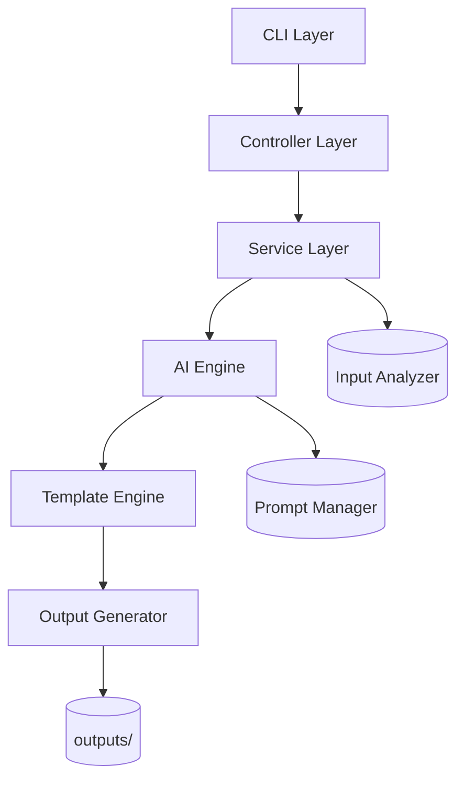
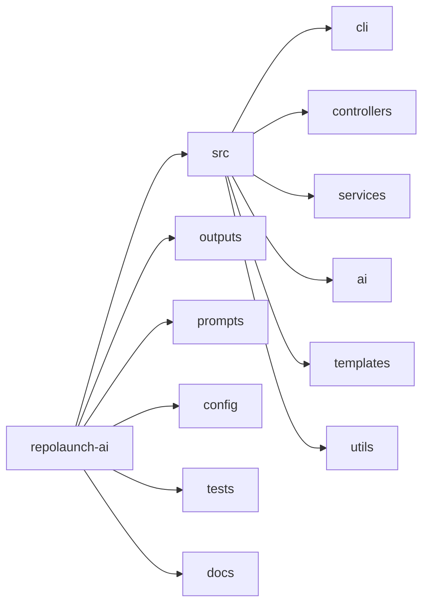
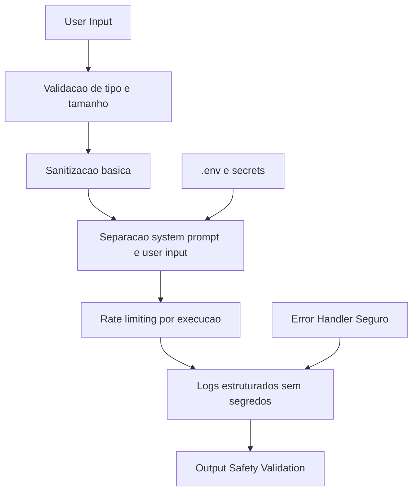

# RepoLaunch AI

<p align="center">
  <strong>Transforme aprendizado em projetos reais prontos para GitHub</strong>
</p>

<p align="center">
  Construido por <strong>FilipiWanderley</strong> para transformar estudo em execucao de verdade.
</p>

<p align="center">
  
  
  
  
  
</p>

---

## O problema que quase todo dev enfrenta

Voce estuda, aprende e pratica, mas trava em pontos criticos:

- Nao sei qual projeto criar
- Nao sei estruturar arquitetura com clareza
- Nao sei escrever documentacao que impressiona
- Nao consigo transformar aprendizado em ativo de carreira

RepoLaunch AI foi criado para fechar esse gap.

---

## O que entra e o que sai

### Input

- Anotacoes em Markdown ou TXT
- Pasta de codigo
- Ideias soltas em texto
- Conteudo de cursos (exemplo: Anthropic Academy)

### Output

- README.md profissional
- ARCHITECTURE.md
- ROADMAP.md
- PROJECT_PLAN.md
- PORTFOLIO_PITCH.md
- Sugestoes de issues

---

## Impacto em segundos

### Exemplo rapido

Input:

> Fiz um curso de IA e quero criar algo com isso

Output:

- projeto estruturado
- arquitetura definida
- plano de execucao
- pitch pronto para LinkedIn

---

## Quick Start

```bash
git clone https://github.com/FilipiWanderley/repolaunch-ai
cd repolaunch-ai
cp .env.example .env
# adicione sua API key

npm install
npx repolaunch init
npx repolaunch analyze ./meus-arquivos
npx repolaunch generate
```

---

## Arquitetura profissional



---

## Estrutura de pastas com visao de camadas



---

## Seguranca em camadas



---

## Stack Cards

| Camada | Stack | Objetivo |
|---|---|---|
| Runtime e CLI |    | Performance, tipagem forte e UX de terminal profissional |
| IA e prompts |   | Geracao confiavel com fallback e padronizacao de saida |
| Qualidade e seguranca |    | Resiliencia, validacao de contrato e seguranca de configuracao |

---

## Como funciona

1. Usuario fornece input (texto, arquivos ou repositorio)
2. Input Analyzer extrai intencao, contexto e tema
3. AI Engine produz estrutura base com prompts controlados
4. Template Engine organiza os documentos finais
5. Output Generator cria os arquivos automaticamente

---

## Casos de uso reais

### Devs

- Transformar estudo em projeto concreto
- Gerar documentacao profissional para portfolio

### Estudantes

- Montar portfolio com mais velocidade
- Estruturar aprendizado em entregaveis

### Criadores

- Organizar ideias e publicar com narrativa tecnica

---

## Engenharia que recrutador enxerga

- Arquitetura modular por camadas
- Separacao clara de responsabilidades
- Engine de templates reutilizavel
- Abstracao para multiplos provedores de IA
- CLI profissional com foco em ship rapido
- Design orientado a produto
- Seguranca como requisito de base

---

## Roadmap

### v1 - MVP

- Geracao de README
- ROADMAP e PROJECT_PLAN
- Fluxo base de analise de texto

### v2

- Analise de repositorio existente
- Integracao com GitHub para issues e PRs

### v3

- Interface web
- Colaboracao
- Exportacao avancada

---

## Filosofia

> Aprender e otimo.
> Construir e o que muda sua carreira.

---

## Inspiracao

Projeto desenvolvido por FilipiWanderley, inspirado por aprendizado em IA aplicada,
incluindo conteudos da Anthropic Academy.

---

## Contribuicao

Contribuicoes sao bem-vindas.

Se esse projeto te ajudou, deixe uma estrela e compartilhe com quem esta evoluindo na carreira.

---

## Autor

**FilipiWanderley**

- Engenheiro focado em IA aplicada
- Construindo ferramentas uteis para desenvolvedores
- Transformando aprendizado em execucao real

---

## RepoLaunch AI

**By FilipiWanderley**

Transforme aprendizado em projetos.
Transforme projetos em oportunidades.